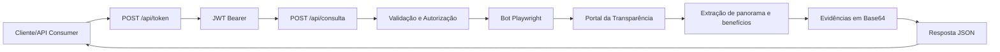

# most-rpa-hyperautomation

Automação RPA/hiperautomação em Python que consulta o Portal da Transparência (consulta “Pessoas Físicas e Jurídicas”), extrai panorama e detalhes de benefícios sociais (Auxílio Brasil, Bolsa Família, Auxílio Emergencial), captura evidências em Base64 e retorna tudo em JSON.

Principais modos de uso:
- **API Django/DRF**: endpoint REST que executa o bot (batch ou single) e entrega JSON.
- **Runner local**: script `main.py` para execuções em lote gravando resultados em `output/`.
- **Hiperautomação (Make + Frontend)**: fluxo de orquestração externo para disparar a automação via webhook, acionar a API do bot e integrar com Google Drive/Sheets.

## Stack e componentes
- Playwright (Python) para navegação e scraping.
- Django + Django REST Framework + drf-spectacular para expor o robô como API e documentação Swagger (`/api/docs/`).
- Bot core em `bot/scraper.py` (usa `bot/navigation.py` e `bot/extraction.py`).
- `main.py` para executar múltiplos alvos em paralelo (ThreadPoolExecutor) e salvar JSONs em `output/`.
- GitHub Actions para integração contínua (testes/smoke) e entrega contínua controlada no Cloud Run.

## Integração contínua e entrega
- **CI (integração contínua):** workflows no GitHub Actions para validações e smoke test (`.github/workflows/e2e-smoke.yml`).
- **CD (deploy):** workflow de build/deploy no Cloud Run (`.github/workflows/google-cloudrun-docker.yml`).
- **Política de gatilho do deploy:** execução **manual** (`workflow_dispatch`) ou **automática apenas por tag de versão** (`push tags: v*`).
- **Sem deploy automático por commit/merge em branch**.

## Estrutura do projeto
```text
most-rpa-hyperautomation/
├── api/                      # Endpoints REST, autenticação e rotas da API
├── bot/                      # Núcleo do robô (navegação, extração, browser, validações)
├── doc/                      # Documentação do desafio (contexto, requisitos, escolhas, status)
├── img/                      # Evidências visuais de integrações externas (Make/Drive/Sheets)
├── output/                   # Resultados JSON gerados nas execuções locais
├── tests/                    # Testes unitários/API (com mocks para o navegador)
├── web/                      # Configuração Django (settings, urls, wsgi)
├── .github/workflows/        # CI/CD e deploy no Cloud Run
├── Dockerfile                # Build da imagem com dependências do Playwright
├── example.env               # Template de variáveis de ambiente
├── main.py                   # Runner local para execuções em lote
├── manage.py                 # Comando de gerenciamento Django
├── requirements.txt          # Dependências Python
├── README.md                 # Guia de uso e operação
└── logs/                     # Logs locais por execução do runner (gerado em runtime)
```

## Fluxo da API


## Requisitos
- Python 3.10+ (testado em Linux)
- `pip install -r requirements.txt`
- Browsers do Playwright instalados: `playwright install`  
  (em Linux headless pode precisar de libs do Chromium: `libnss3`, `libatk1.0-0`, `libgtk-3-0`, etc.)

## Instalação rápida
```bash
python -m venv venv
source venv/bin/activate
pip install -r requirements.txt
playwright install
cp example.env .env   # ajuste os valores reais
```
> Em produção (Cloud Run ou similar), ajuste `ALLOWED_HOSTS` para incluir o domínio do serviço (ex.: `*.run.app`).

## Deploy com Docker (local)
```bash
docker build -t most-rpa .
docker run --env-file .env -p 8000:8000 most-rpa
```
Swagger: `http://127.0.0.1:8000/api/docs/`

## Executar como API (Django)
```bash
python manage.py runserver 8000
```
- Documentação interativa (Swagger): `http://127.0.0.1:8000/api/docs/`
- Esquema OpenAPI (YAML/JSON): `http://127.0.0.1:8000/api/schema/`
- Autorização: obtenha um token OAuth2 (client_credentials) em `POST /api/token/` enviando `client_id` e `client_secret`; use o token retornado no header `Authorization: Bearer <token>`. Tokens HS256 são assinados com `API_MASTER_KEY` (mín. 32 chars) e expiram após o TTL configurado (`API_TOKEN_TTL`).

### Autenticação (OAuth2 client_credentials simplificado)
- `POST /api/token/` com corpo `{"grant_type": "client_credentials", "client_id": "<ID>", "client_secret": "<SECRET>", "scope": "bot:read"}`.
- Mapeamento de variáveis de ambiente: `client_id` = `OAUTH_CLIENT_ID`, `client_secret` = `OAUTH_CLIENT_SECRET`, audience = `OAUTH_AUDIENCE`, TTL = `API_TOKEN_TTL`.
- Use o `access_token` retornado no header `Authorization: Bearer <token>` ao chamar `/api/consulta/`. Tokens HS256, `aud` configurado por `OAUTH_AUDIENCE`, expiram após `API_TOKEN_TTL` segundos, e são assinados com `API_MASTER_KEY` (>=32 chars).

### Endpoint principal
`POST /api/consulta/`

Payloads aceitos:
- **Consulta única**: `{"consulta": "04031769644", "refinar_busca": false}`
- **Lote simples**: `{"consultas": ["04031769644", "12345678901"], "refinar_busca": false}` (máx. 3 entradas)
- **Lote avançado**: `{"itens": [{"consulta": "04031769644"}, {"consulta": "12345678901", "refinar_busca": false}]}` (máx. 3 itens; `refinar_busca` padrão = false)

Respostas seguem o JSON do bot (pessoa, benefícios, meta) e sempre incluem `id_consulta` (UUID) e `data_hora_consulta` para auditoria. Em caso de erro, retorna `{ "status": "error", "error": "..." }`.

## Documentação do desafio
- Contexto: [doc/01-documentação-de-contexto.md](/home/jcarlos/Documents/work-projects/most-rpa-hyperautomation/doc/01-documentação-de-contexto.md)
- Requisitos: [doc/02-requisito-do-projeto.md](/home/jcarlos/Documents/work-projects/most-rpa-hyperautomation/doc/02-requisito-do-projeto.md)
- Escolhas e desafios: [doc/03-escolhas-e-desafios-tecnicos.md](/home/jcarlos/Documents/work-projects/most-rpa-hyperautomation/doc/03-escolhas-e-desafios-tecnicos.md)
- Status e roadmap: [doc/04-status-do-projeto.md](/home/jcarlos/Documents/work-projects/most-rpa-hyperautomation/doc/04-status-do-projeto.md)

## Aderência ao enunciado MOST
- Parte 1 (obrigatória): **implementada** com Playwright headless, extração de panorama/benefícios e evidências Base64.
- API online: **implementada** com Swagger/OpenAPI.
- Execução simultânea: **implementada** (runner local e batch da API).
- Parte 2 (bônus): **implementada** com **Make**, incluindo integração com Google Drive/Sheets.
- Frontend de operação: **implementado** para acionar webhook do Make e iniciar a automação ponta a ponta.

### Formato das respostas da API

#### 1) Consulta única com sucesso (`200 OK`)
```json
{
  "id_consulta": "6a7e35d0-6d19-4e53-8b02-17bb30a8b7f6",
  "data_hora_consulta": "14/03/2026 - 10:30",
  "pessoa": {
    "consulta": "04031769644",
    "nome": "NOME DA PESSOA",
    "cpf": "***.***.***-**",
    "localidade": "UF",
    "quantidade_beneficios": 1,
    "total_recursos_favorecidos": "R$ 600,00"
  },
  "beneficios": [
    {
      "tipo": "Auxílio Brasil",
      "nis": "1234 5678 901",
      "valor_recebido": "R$ 600,00",
      "detalhe_href": "/...",
      "detalhe_evidencia": "<base64>",
      "parcelas": [
        {
          "mes_folha": "01/2024",
          "mes_referencia": "01/2024",
          "uf": "SP",
          "municipio": "São Paulo",
          "quantidade_dependentes": "0",
          "valor": "R$ 600,00"
        }
      ]
    }
  ],
  "meta": {
    "id_consulta": "6a7e35d0-6d19-4e53-8b02-17bb30a8b7f6",
    "data_hora_consulta": "14/03/2026 - 10:30",
    "resultados_encontrados": 1,
    "beneficios_encontrados": [
      "Auxílio Brasil"
    ],
    "panorama_relacao": "<base64>",
    "total_valor_recebido": 600.0,
    "total_valor_recebido_formatado": "R$ 600,00"
  }
}
```

#### 2) Consulta única sem resultado (`200 OK` com erro de negócio)
```json
{
  "id_consulta": "67df0b30-d289-4f91-9ff3-1577ec67b4b3",
  "data_hora_consulta": "14/03/2026 - 10:31",
  "status": "error",
  "error": "Não foi possível retornar os dados no tempo de resposta solicitado",
  "pessoa": {
    "consulta": "04031769644",
    "nome": "N/A",
    "cpf": "N/A",
    "localidade": "N/A",
    "total_recursos_favorecidos": "R$ 0,00"
  },
  "beneficios": [],
  "meta": {
    "id_consulta": "67df0b30-d289-4f91-9ff3-1577ec67b4b3",
    "data_hora_consulta": "14/03/2026 - 10:31",
    "resultados_encontrados": 0,
    "evidencia_resultados_zero": "<base64>",
    "mensagem": "Não foi possível retornar os dados no tempo de resposta solicitado",
    "total_valor_recebido": 0.0,
    "total_valor_recebido_formatado": "R$ 0,00"
  }
}
```
#### 3) Lote (`200 OK`)
```json
{
  "resultados": [
    {
      "consulta": "04031769644",
      "status": "ok",
      "resultado": {
        "id_consulta": "6a7e35d0-6d19-4e53-8b02-17bb30a8b7f6",
        "data_hora_consulta": "14/03/2026 - 10:30",
        "pessoa": {
          "consulta": "04031769644",
          "nome": "NOME DA PESSOA",
          "cpf": "***.***.***-**",
          "localidade": "UF"
        },
        "beneficios": [],
        "meta": {
          "id_consulta": "6a7e35d0-6d19-4e53-8b02-17bb30a8b7f6",
          "data_hora_consulta": "14/03/2026 - 10:30"
        }
      }
    },
    {
      "consulta": "123ABC",
      "status": "invalid",
      "resultado": {
        "status": "invalid",
        "error": "Entrada inválida: use CPF/NIS com 11 dígitos ou nome válido.",
        "id_consulta": "cbef5981-1c2a-4a9b-a6f4-5a5347dff67d",
        "data_hora_consulta": "14/03/2026 - 10:32",
        "pessoa": {
          "consulta": "123ABC",
          "nome": "N/A",
          "cpf": "N/A",
          "localidade": "N/A"
        },
        "meta": {
          "id_consulta": "cbef5981-1c2a-4a9b-a6f4-5a5347dff67d",
          "data_hora_consulta": "14/03/2026 - 10:32"
        }
      }
    }
  ]
}
```
#### 4) Erros de protocolo/segurança

| HTTP | Quando acontece | Exemplo |
|------|------------------|---------|
| `400` | payload inválido, limite excedido, entrada inválida no single | `{"status":"error","error":"Máximo de 3 consultas por requisição"}` |
| `401` | sem token ou token inválido/expirado | `{"status":"error","error":"Missing bearer token"}` |
| `403` | token sem escopo `bot:read` | `{"status":"error","error":"Insufficient scope"}` |
| `500` | falha inesperada no processamento | `{"status":"error","error":"<mensagem-interna>"}` |

## Executar via runner local
Edite a lista `lista_alvos` em `main.py` e rode:
```bash
python main.py
```
Cada alvo gera um `output/result_<alvo>_<timestamp>.json`. Limite sugerido: até 3 alvos por execução.

## Parâmetros importantes
- `TransparencyBot(headless=True, alvo="CPF|NIS|Nome", usar_refine=False)` — passe o alvo na criação do bot.
- `usar_refine=True` ativa o fluxo “Refine a Busca”; `False` usa a busca simples (lupa).
- Na API, use apenas o campo `refinar_busca`.
- Na API, o paralelismo por requisição é configurável por `BOT_MAX_WORKERS` (valor recomendado em produção: `1` para estabilidade do Chromium).
- Browser/Playwright via `.env`:
  - `PLAYWRIGHT_CHANNEL`: `chromium` (padrão) ou `chrome`.
  - `PLAYWRIGHT_STORAGE_STATE_PATH`: caminho opcional de `storage_state.json` (vazio = não reutiliza sessão).
  - `PLAYWRIGHT_USE_STEALTH_FLAGS`: habilita `--disable-blink-features=AutomationControlled`.
  - `PLAYWRIGHT_HIDE_WEBDRIVER`: aplica override de `navigator.webdriver`.
  - `PLAYWRIGHT_USE_STEALTH_PACKAGE`: habilita `playwright-stealth` (`Stealth().apply_stealth_sync(page)`).
  - `PLAYWRIGHT_USER_AGENT`: user-agent customizado; se vazio, usa o default do projeto.
  - `PLAYWRIGHT_SLOW_MO_MS`: delay entre ações (ms), útil para depuração e estabilidade.

<a id="env-reference"></a>
## Referência de variáveis de ambiente

### API e segurança
| Variável | Obrigatória | Valor padrão | Função |
|---|---|---|---|
| `DJANGO_SECRET_KEY` | Sim | - | Segredo interno do Django (assinatura de sessão e componentes de segurança). |
| `API_MASTER_KEY` | Sim | - | Chave usada para assinar/validar JWT HS256 no fluxo de autenticação. |
| `ALLOWED_HOSTS` | Sim (produção) | `127.0.0.1,localhost` | Define hosts/domínios permitidos pelo Django. |
| `DEBUG` | Não | `False` | Liga/desliga modo de depuração do Django. |
| `API_TOKEN_TTL` | Não | `600` | Tempo de vida do token OAuth (`/api/token/`), em segundos. |
| `OAUTH_CLIENT_ID` | Sim | - | `client_id` aceito no endpoint de token. |
| `OAUTH_CLIENT_SECRET` | Sim | - | `client_secret` aceito no endpoint de token. |
| `OAUTH_AUDIENCE` | Não | `most-rpa-api` | Claim `aud` emitido/validado no token JWT. |
| `BOT_MAX_WORKERS` | Não | `1` | Número máximo de workers no batch da API (`/api/consulta/`). |

### Browser e Playwright
| Variável | Obrigatória | Valor padrão | Função |
|---|---|---|---|
| `PLAYWRIGHT_CHANNEL` | Não | `chromium` | Canal do navegador: `chromium` ou `chrome`. |
| `PLAYWRIGHT_STORAGE_STATE_PATH` | Não | vazio | Reutiliza sessão/cookies de um `storage_state.json`. |
| `PLAYWRIGHT_USE_STEALTH_FLAGS` | Não | `true` | Adiciona flags anti-automação no launch do browser. |
| `PLAYWRIGHT_HIDE_WEBDRIVER` | Não | `true` | Oculta `navigator.webdriver` via script de inicialização. |
| `PLAYWRIGHT_USE_STEALTH_PACKAGE` | Não | `true` | Aplica `playwright-stealth` na página (quando instalado). |
| `PLAYWRIGHT_USER_AGENT` | Não | UA padrão do projeto | Define User-Agent customizado para contexto do browser. |
| `PLAYWRIGHT_SLOW_MO_MS` | Não | `0` | Delay entre ações do Playwright (ms), útil para debug/estabilidade. |


## Testes

### Testes locais rápidos (sem ambiente externo)
```bash
pytest -q -m "not e2e"
```

Cobertura principal desse bloco:
- `tests/test_validators.py`: validação de CPF/NIS/nome.
- `tests/test_navigation.py`: score de nome e escolha do resultado mais próximo.
- `tests/test_bot.py`: contrato de saída do bot (`N/A`, `id_consulta`, `data_hora_consulta`, erros e evidências).
- `tests/test_browser_env.py`: leitura de envs do Playwright/browser.
- `tests/test_main.py`: runner local (`main.py`), duração e comportamento de execução.
- `tests/test_api_token.py`: geração e validação básica de token.
- `tests/test_api_consulta.py`: endpoint `/api/consulta` (single/lote), autenticação, limites e erros.

### Rodar toda a suíte (inclui E2E se configurado)
```bash
pytest
```
Observação: sem as variáveis de ambiente do E2E, rode preferencialmente `pytest -q -m "not e2e"`.

### Teste E2E smoke (ambiente real)
- Arquivo: `tests/test_e2e_smoke.py` (marcador `e2e`).
- Objetivo: validar contrato da API online com chamadas reais concorrentes (`refinar_busca=false` e `refinar_busca=true`), reduzindo risco de regressão por intermitência de UI externa.
- Variáveis necessárias:
  - `E2E_BASE_URL` (ex.: `https://<seu-servico>.run.app`)
  - `E2E_CLIENT_ID`
  - `E2E_CLIENT_SECRET`
  - `E2E_CONSULTA_BASE`
  - `E2E_CONSULTA_REFINADA`
  - `E2E_REQUIRE_SUCCESS` (opcional; quando `true`, exige sucesso funcional nas duas chamadas concorrentes)
- Execução local:
```bash
E2E_BASE_URL=... \
E2E_CLIENT_ID=... \
E2E_CLIENT_SECRET=... \
E2E_CONSULTA_BASE=... \
E2E_CONSULTA_REFINADA=... \
E2E_REQUIRE_SUCCESS=true \
./venv/bin/pytest -q tests/test_e2e_smoke.py -m e2e
```
- Artefatos são salvos em `output/e2e-artifacts/` (respostas, status HTTP, durações e `junit.xml` no CI).

### GitHub Actions (E2E)
- Workflow: `.github/workflows/e2e-smoke.yml`
- Disparo: manual (`workflow_dispatch`) e agendado diário.
- Configure os secrets do repositório:
  - `E2E_BASE_URL`, `E2E_CLIENT_ID`, `E2E_CLIENT_SECRET`, `E2E_CONSULTA_BASE`, `E2E_CONSULTA_REFINADA`.

### Evidência E2E validada
- Execução pós-deploy aprovada em **14/03/2026** (run `23096919987`): [e2e-smoke-artifacts](/home/jcarlos/Documents/work-projects/most-rpa-hyperautomation/doc/evidencias/e2e-smoke/2026-03-14-run-23096919987/e2e-smoke-artifacts)
- Metadados da execução: [README da evidência](/home/jcarlos/Documents/work-projects/most-rpa-hyperautomation/doc/evidencias/e2e-smoke/2026-03-14-run-23096919987/README.md)
- Rodada com concorrência (local): [e2e-smoke-artifacts concorrencia](/home/jcarlos/Documents/work-projects/most-rpa-hyperautomation/doc/evidencias/e2e-smoke/2026-03-14-run-local-concorrencia/e2e-smoke-artifacts)

### Evidências de integrações externas
- Google Sheets (registro da execução): [google_sheets_evidencia.png](/home/jcarlos/Documents/work-projects/most-rpa-hyperautomation/img/google_sheets_evidencia.png)
- Google Drive (arquivo gerado): [google_driver_evidencia.png](/home/jcarlos/Documents/work-projects/most-rpa-hyperautomation/img/google_driver_evidencia.png)
- Make (workflow/orquestração): [make_evidencia_workflow.png](/home/jcarlos/Documents/work-projects/most-rpa-hyperautomation/img/make_evidencia_workflow.png)

## Estrutura de saída (resumo)
- `id_consulta`: UUID da execução (sempre presente).
- `data_hora_consulta`: timestamp único da consulta (`dd/mm/aaaa - HH:MM`, sempre presente).
- `pessoa`: `consulta`, `nome`, `cpf`, `localidade`, `quantidade_beneficios`, `total_recursos_favorecidos`… (campos básicos com `N/A` quando ausentes).
- `beneficios`: lista com `tipo`, `nis`, `valor_recebido`, `detalhe_href`, `detalhe_evidencia` (Base64), `parcelas` (itens das tabelas de detalhe).
- `meta`: inclui também `id_consulta`, `data_hora_consulta`, `total_valor_recebido`, `total_valor_recebido_formatado`, além de `resultados_encontrados`, `beneficios_encontrados`, `panorama_relacao` (Base64) e evidências.

## Boas práticas e troubleshooting
- Se o Chromium não subir, reinstale deps do sistema e rode `playwright install`.
- Se usar `PLAYWRIGHT_CHANNEL=chrome`, instale o Chrome no ambiente ou rode `playwright install chrome`.
- Se usar `PLAYWRIGHT_USE_STEALTH_PACKAGE=true`, instale a dependência: `pip install playwright-stealth`.
- Site pode mudar layout; seletores estão em `bot/navigation.py` e `bot/extraction.py`.
- O Portal da Transparência pode acionar challenge/telemetria. Atualmente o projeto não classifica automaticamente como `status="blocked"` para evitar falso positivo.
- Logs em `bot_execution.log` (runner) e via logging Django no endpoint.

## Segurança
Uso apenas para fins legais; trate dados pessoais conforme LGPD.
- A API não persiste consultas em banco de dados: processa em memória e retorna o resultado na resposta.
- No fluxo externo de hiperautomação (Make -> Google Drive/Google Sheets), há persistência de artefatos/dados; aplique política de retenção/expurgo, controle de acesso e minimização de dados.
- Evidências em Base64 são transitórias no fluxo da API, mas podem ser armazenadas externamente quando integrações estiverem habilitadas.

## Cenários de teste do desafio
Os cenários fornecidos pela MOST estão documentados em `doc/02-requisito-do-projeto.md` (seção “Cenários de teste”). A suíte `pytest` cobre os casos de sucesso/erro por CPF/NIS e Nome, além de cenário com parcelas e evidências.
