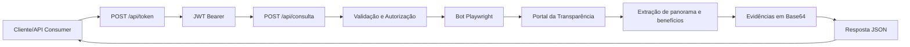

# most-rpa-hyperautomation

Automação RPA/hiperautomação em Python que consulta o Portal da Transparência (consulta “Pessoas Físicas e Jurídicas”), extrai panorama e detalhes de benefícios sociais (Auxílio Brasil, Bolsa Família, Auxílio Emergencial), captura evidências em Base64 e retorna tudo em JSON.

Principais modos de uso:
- **API Django/DRF**: endpoint REST que executa o bot (batch ou single) e entrega JSON.
- **Runner local**: script `main.py` para execuções em lote gravando resultados em `output/`.

## Stack e componentes
- Playwright (Python) para navegação e scraping.
- Django + Django REST Framework + drf-spectacular para expor o robô como API e documentação Swagger (`/api/docs/`).
- Bot core em `bot/scraper.py` (usa `bot/navigation.py` e `bot/extraction.py`).
- `main.py` para executar múltiplos alvos em paralelo (ThreadPoolExecutor) e salvar JSONs em `output/`.

## Estrutura do projeto
```text
most-rpa-hyperautomation/
├── api/                      # Endpoints REST, autenticação e rotas da API
├── bot/                      # Núcleo do robô (navegação, extração, browser, validações)
├── doc/                      # Documentação do desafio (contexto, requisitos, escolhas, status)
├── tests/                    # Testes unitários/API (com mocks para o navegador)
├── web/                      # Configuração Django (settings, urls, wsgi)
├── .github/workflows/        # CI/CD e deploy no Cloud Run
├── Dockerfile                # Build da imagem com dependências do Playwright
├── main.py                   # Runner local para execuções em lote
├── manage.py                 # Comando de gerenciamento Django
├── requirements.txt          # Dependências Python
└── README.md                 # Guia de uso e operação
```

## Fluxo da API


## Requisitos
- Python 3.10+ (testado em Linux)
- `pip install -r requirements.txt`
- Browsers do Playwright instalados: `playwright install`  
  (em Linux headless pode precisar de libs do Chromium: `libnss3`, `libatk1.0-0`, `libgtk-3-0`, etc.)

## Instalação rápida
```bash
python -m venv venv
source venv/bin/activate
pip install -r requirements.txt
playwright install
cp example.env .env   # ajuste os valores reais
```
> Em produção (Cloud Run ou similar), ajuste `ALLOWED_HOSTS` para incluir o domínio do serviço (ex.: `*.run.app`).

## Deploy com Docker (local)
```bash
docker build -t most-rpa .
docker run --env-file .env -p 8000:8000 most-rpa
```
Swagger: `http://127.0.0.1:8000/api/docs/`

## Executar como API (Django)
```bash
python manage.py runserver 8000
```
- Documentação interativa (Swagger): `http://127.0.0.1:8000/api/docs/`
- Esquema OpenAPI (YAML/JSON): `http://127.0.0.1:8000/api/schema/`
- Autorização: obtenha um token OAuth2 (client_credentials) em `POST /api/token/` enviando `client_id` e `client_secret`; use o token retornado no header `Authorization: Bearer <token>`. Tokens HS256 são assinados com `API_MASTER_KEY` (mín. 32 chars) e expiram após o TTL configurado (`API_TOKEN_TTL`).

### Autenticação (OAuth2 client_credentials simplificado)
- `POST /api/token/` com corpo `{"grant_type": "client_credentials", "client_id": "<ID>", "client_secret": "<SECRET>", "scope": "bot:read"}`.
- Mapeamento de variáveis de ambiente: `client_id` = `OAUTH_CLIENT_ID`, `client_secret` = `OAUTH_CLIENT_SECRET`, audience = `OAUTH_AUDIENCE`, TTL = `API_TOKEN_TTL`.
- Use o `access_token` retornado no header `Authorization: Bearer <token>` ao chamar `/api/consulta/`. Tokens HS256, `aud` configurado por `OAUTH_AUDIENCE`, expiram após `API_TOKEN_TTL` segundos, e são assinados com `API_MASTER_KEY` (>=32 chars).

### Endpoint principal
`POST /api/consulta/`

Payloads aceitos:
- **Consulta única**: `{"consulta": "04031769644", "refinar_busca": false}`
- **Lote simples**: `{"consultas": ["04031769644", "12345678901"], "refinar_busca": false}` (máx. 3 entradas)
- **Lote avançado**: `{"itens": [{"consulta": "04031769644"}, {"consulta": "12345678901", "refinar_busca": false}]}` (máx. 3 itens; `refinar_busca` padrão = false)
- **Compatibilidade**: o campo legado `refine` continua aceito.

Respostas seguem o JSON do bot (pessoa, benefícios, meta). Em caso de erro, retorna `{ "status": "error", "error": "..." }`.

### Formato das respostas da API

#### 1) Consulta única com sucesso (`200 OK`)
```json
{
  "pessoa": {
    "nome": "NOME DA PESSOA",
    "cpf": "***.***.***-**",
    "localidade": "UF",
    "quantidade_beneficios": 1
  },
  "beneficios": [
    {
      "tipo": "Auxílio Brasil",
      "nis": "1234 5678 901",
      "valor_recebido": "R$ 600,00",
      "detalhe_href": "/...",
      "detalhe_evidencia": "<base64>",
      "parcelas": [
        {
          "mes_folha": "01/2024",
          "mes_referencia": "01/2024",
          "uf": "SP",
          "municipio": "São Paulo",
          "quantidade_dependentes": "0",
          "valor": "R$ 600,00"
        }
      ]
    }
  ],
  "meta": {
    "resultados_encontrados": 1,
    "beneficios_encontrados": [
      "Auxílio Brasil"
    ],
    "panorama_relacao": "<base64>",
    "data_consulta": "14/03/2026",
    "hora_consulta": "10:30"
  }
}
```

#### 2) Consulta única sem resultado (`200 OK` com erro de negócio)
```json
{
  "status": "error",
  "error": "Não foi possível retornar os dados no tempo de resposta solicitado",
  "pessoa": {
    "consulta": "04031769644"
  },
  "beneficios": [],
  "meta": {
    "resultados_encontrados": 0,
    "evidencia_resultados_zero": "<base64>",
    "data_consulta": "14/03/2026",
    "hora_consulta": "10:31",
    "mensagem": "Não foi possível retornar os dados no tempo de resposta solicitado"
  }
}
```

#### 3) Lote (`200 OK`)
```json
{
  "resultados": [
    {
      "consulta": "04031769644",
      "status": "ok",
      "resultado": {
        "pessoa": {},
        "beneficios": [],
        "meta": {}
      }
    },
    {
      "consulta": "NOME INEXISTENTE",
      "status": "invalid",
      "resultado": {
        "status": "invalid",
        "error": "..."
      }
    }
  ]
}
```

#### 4) Erros de protocolo/segurança

| HTTP | Quando acontece | Exemplo |
|------|------------------|---------|
| `400` | payload inválido, limite excedido, entrada inválida no single | `{"status":"error","error":"Máximo de 3 consultas por requisição"}` |
| `401` | sem token ou token inválido/expirado | `{"status":"error","error":"Missing bearer token"}` |
| `403` | token sem escopo `bot:read` | `{"status":"error","error":"Insufficient scope"}` |
| `500` | falha inesperada no processamento | `{"status":"error","error":"<mensagem-interna>"}` |

## Executar via runner local
Edite a lista `lista_alvos` em `main.py` e rode:
```bash
python main.py
```
Cada alvo gera um `output/result_<alvo>_<timestamp>.json`. Limite sugerido: até 3 alvos por execução.

## Parâmetros importantes
- `TransparencyBot(headless=True, alvo="CPF|NIS|Nome", usar_refine=False)` — passe o alvo na criação do bot.
- `usar_refine=True` ativa o fluxo “Refine a Busca”; `False` usa a busca simples (lupa).
- Na API, prefira o campo `refinar_busca`; `refine` é mantido apenas por compatibilidade.
- Na API, o paralelismo por requisição é configurável por `BOT_MAX_WORKERS` (valor recomendado em produção: `1` para estabilidade do Chromium).

## Testes
```bash
pytest
```
Os testes unitários cobrem validação de entrada e endpoints (`/api/token/`, `/api/consulta/`) com mocks para evitar abrir o navegador.

### Teste E2E smoke (ambiente real)
- Arquivo: `tests/test_e2e_smoke.py` (marcador `e2e`).
- Objetivo: validar contrato da API online com chamadas reais concorrentes (`refinar_busca=false` e `refinar_busca=true`), reduzindo risco de regressão por intermitência de UI externa.
- Variáveis necessárias:
  - `E2E_BASE_URL` (ex.: `https://<seu-servico>.run.app`)
  - `E2E_CLIENT_ID`
  - `E2E_CLIENT_SECRET`
  - `E2E_CONSULTA_BASE`
  - `E2E_CONSULTA_REFINADA` (opcional; se ausente, reutiliza `E2E_CONSULTA_BASE`)
- Execução local:
```bash
E2E_BASE_URL=... \
E2E_CLIENT_ID=... \
E2E_CLIENT_SECRET=... \
E2E_CONSULTA_BASE=... \
./venv/bin/pytest -q tests/test_e2e_smoke.py -m e2e
```
- Artefatos são salvos em `output/e2e-artifacts/` (respostas, status HTTP, durações e `junit.xml` no CI).

### GitHub Actions (E2E)
- Workflow: `.github/workflows/e2e-smoke.yml`
- Disparo: manual (`workflow_dispatch`) e agendado diário.
- Configure os secrets do repositório:
  - `E2E_BASE_URL`, `E2E_CLIENT_ID`, `E2E_CLIENT_SECRET`, `E2E_CONSULTA_BASE`, `E2E_CONSULTA_REFINADA` (opcional).

### Evidência E2E validada
- Execução pós-deploy aprovada (run `23096919987`): [e2e-smoke-artifacts](/home/jcarlos/Documents/work-projects/most-rpa-hyperautomation/doc/evidencias/e2e-smoke/2026-03-14-run-23096919987/e2e-smoke-artifacts)
- Metadados da execução: [README da evidência](/home/jcarlos/Documents/work-projects/most-rpa-hyperautomation/doc/evidencias/e2e-smoke/2026-03-14-run-23096919987/README.md)

## Estrutura de saída (resumo)
- `pessoa`: `nome`, `cpf`, `localidade`, `quantidade_beneficios`…
- `beneficios`: lista com `tipo`, `nis`, `valor_recebido`, `detalhe_href`, `detalhe_evidencia` (Base64), `parcelas` (itens das tabelas de detalhe).
- `meta`: `resultados_encontrados`, `beneficios_encontrados`, `panorama_relacao` (Base64), `data_consulta`, `hora_consulta`.

## Boas práticas e troubleshooting
- Se o Chromium não subir, reinstale deps do sistema e rode `playwright install`.
- Site pode mudar layout; seletores estão em `bot/navigation.py` e `bot/extraction.py`.
- Logs em `bot_execution.log` (runner) e via logging Django no endpoint.

## Segurança
Uso apenas para fins legais; trate dados pessoais conforme LGPD. Armazene resultados de forma transitória ou conforme política interna.
- Não versione segredos reais no repositório. Use `example.env` como referência, mantenha `.env` fora do Git e injete credenciais via secrets do ambiente (ex.: GitHub Secrets/Cloud Run).

## Cenários de teste do desafio
Os cenários fornecidos pela MOST estão documentados em `doc/02-requisito-do-projeto.md` (seção “Cenários de teste”). A suíte `pytest` cobre os casos de sucesso/erro por CPF/NIS e Nome, além de cenário com parcelas e evidências.
