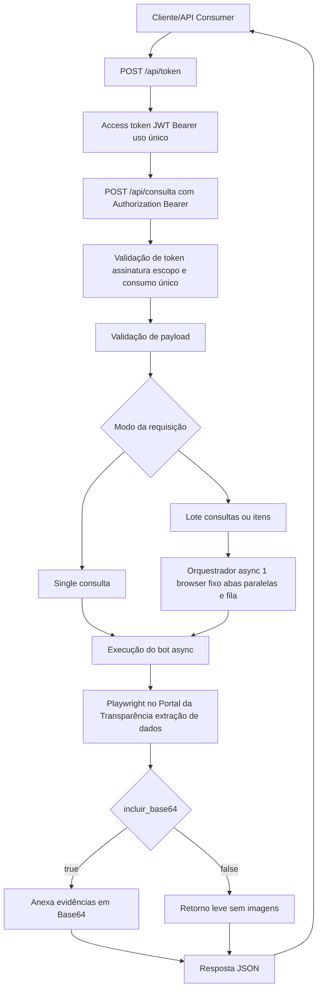

# most-rpa-hyperautomation

Automação RPA/hiperautomação em Python que consulta o Portal da Transparência (consulta “Pessoas Físicas e Jurídicas”), extrai panorama e detalhes de benefícios sociais (Auxílio Brasil, Bolsa Família, Auxílio Emergencial), captura evidências em Base64 e retorna tudo em JSON.

Principais modos de uso:
- **API Django/DRF**: endpoint REST que executa o bot (batch ou single) e entrega JSON.
- **Runner local async**: script `bot/main.py` para execuções unitárias ou em lote, gravando resultados em `output/`.
- **Hiperautomação (Make + Frontend externo)**: fluxo de orquestração externo para disparar a automação via webhook, acionar a API do bot e integrar com Google Drive/Sheets.

## Links rapidos (homologacao)
```text
API (Swagger): https://most-rpa-hyperautomation-2k5peguzzq-ue.a.run.app/api/docs/
Make (cenario): https://us2.make.com/2007415/scenarios/4402917/edit
```
> Observacao: os links acima referenciam o ambiente de homologacao utilizado no projeto/desafio.

## Stack e componentes
- Playwright (Python) para navegação e scraping.
- Django + Django REST Framework + drf-spectacular para API REST e documentação OpenAPI/Swagger (`/api/docs/`).
- Autenticação OAuth2 `client_credentials` + JWT HS256 de uso único por consulta (`api/auth.py`).
- Bot assíncrono em `bot/scraper.py`, com navegação em `bot/navigation.py`, extração em `bot/extraction.py` e validação em `bot/validators.py`.
- Orquestração de concorrência/fila em `bot/orchestrator.py` (browser fixo em `1` e paralelismo por abas).
- Runner local em `bot/main.py` e runner de stress em `scripts/run_bot_batch.py`.
- Observabilidade com `django-prometheus`, Prometheus e Grafana (alertas Telegram validados em ambiente local).
- GitHub Actions para CI (testes/smoke/E2E) e CD controlado no Cloud Run.

## Integração contínua e entrega
- **CI (integração contínua):** workflows no GitHub Actions para validações e smoke test (`.github/workflows/e2e-smoke.yml`).
- **CD (deploy):** workflow de build/deploy no Cloud Run (`.github/workflows/google-cloudrun-docker.yml`).
- **Política de gatilho do deploy:** execução **manual** (`workflow_dispatch`) ou **automática apenas por tag de versão** (`push tags: v*`).
- **Sem deploy automático por commit/merge em branch**.

## Estrutura do projeto
Itens versionados no repositório:
```text
most-rpa-hyperautomation/
├── api/                      # Endpoints REST, autenticação e rotas da API
├── bot/                      # Núcleo do robô (navegação, extração, browser, validações)
├── doc/                      # Documentação do desafio (contexto, requisitos, escolhas, status)
├── img/                      # Evidências visuais (integrações, observabilidade e demo)
├── monitoring/               # Configurações de observabilidade (Prometheus/Grafana)
├── scripts/                  # Scripts auxiliares (stress monitor e batch runner)
├── tests/                    # Testes unitários/API (com mocks para o navegador)
├── web/                      # Configuração Django (settings, urls, wsgi)
├── .github/workflows/        # CI/CD e deploy no Cloud Run
├── Dockerfile                # Build da imagem com dependências do Playwright
├── docker-compose.observability.yml  # Stack local Prometheus + Grafana
├── docker-compose.observability.alerting-bootstrap.yml  # Bootstrap opcional de alertas Grafana
├── docker-compose.bot-stress.yml     # Stress do bot sem API
├── .env.example              # Template alternativo de variáveis de ambiente
├── manage.py                 # Comando de gerenciamento Django
├── requirements.txt          # Dependências Python
└── README.md                 # Guia de uso e operação
```

Itens locais (ignorados no Git) usados em runtime:
- `bot_sync_v1/` (legado local)
- `output/` (resultados gerados)
- `logs/` (logs de execução/stress)
- `.env` e arquivos `*.env` (segredos/configuração local)

## Fluxo da API

```mermaid
flowchart TD
    A[Cliente/API Consumer] --> B[POST /api/token]
    B --> C[Access token JWT Bearer uso único]
    C --> D[POST /api/consulta com Authorization Bearer]
    D --> E[Validação de token assinatura escopo e consumo único]
    E --> F[Validação de payload]
    F --> G{Modo da requisição}
    G --> H[Single consulta]
    G --> I[Lote consultas ou itens]
    I --> J[Orquestrador async 1 browser fixo abas paralelas e fila]
    H --> K[Execução do bot async]
    J --> K
    K --> L[Playwright no Portal da Transparência extração de dados]
    L --> M{incluir_base64}
    M -->|true| N[Anexa evidências em Base64]
    M -->|false| O[Retorno leve sem imagens]
    N --> P[Resposta JSON]
    O --> P
    P --> A
```

## Requisitos
- Python 3.10+ (recomendado 3.12, alinhado com Docker e CI)
- `pip` e `venv` para instalação das dependências Python
- Browsers do Playwright instalados: `playwright install`  
  (em Linux headless pode precisar de libs do Chromium: `libnss3`, `libatk1.0-0`, `libgtk-3-0`, etc.)
- Docker e Docker Compose (opcional, para execução containerizada, observabilidade e stress test)

## Instalação rápida
```bash
python3 -m venv venv
source venv/bin/activate
pip install -r requirements.txt
playwright install
cp .env.example .env   # ajuste os valores reais
```
> Em produção (Cloud Run ou similar), ajuste `ALLOWED_HOSTS` para incluir o domínio do serviço (ex.: `*.run.app`).

## Deploy com Docker (local)
```bash
docker build -t most-rpa .
docker run --env-file .env -p 8000:8000 most-rpa
```
Swagger: `http://127.0.0.1:8000/api/docs/`

## Observabilidade (resumo)
- Stack local: Prometheus + Grafana, com alertas via Telegram no Grafana.
- Métricas da API em `GET /metrics` e dashboard provisionado em `monitoring/grafana/dashboards/most-rpa-api-overview.json`.
- Subida rápida (manual):
```bash
docker compose -f docker-compose.observability.yml up -d
```
- Bootstrap opcional de alertas:
```bash
docker compose -f docker-compose.observability.yml -f docker-compose.observability.alerting-bootstrap.yml up -d --force-recreate grafana
```
- Detalhes completos (arquitetura, métricas, PromQL e operação): [doc/06-observabilidade.md](/home/jcarlos/Documents/work-projects/most-rpa-hyperautomation/doc/06-observabilidade.md)
- Nota de escopo: no contexto do desafio, a stack de observabilidade foi validada localmente e não mantida em cloud por custo.

## Teste de estresse do bot (resumo)
- Ambiente de referência dos benchmarks: **2 GB RAM / 3 CPU** (container).
- Execução padrão:
```bash
COMPOSE_FILE=docker-compose.bot-stress.yml ./scripts/run_stress_monitor.sh
```
- Artefatos gerados por execução: `docker_stats.csv`, `container.log` e `meta.txt` em `logs/stress/<benchmark>/<timestamp>/`.
- Detalhes completos (parâmetros, cenários e histórico de benchmark): [doc/05-parametros-do-teste-de-estresse.md](/home/jcarlos/Documents/work-projects/most-rpa-hyperautomation/doc/05-parametros-do-teste-de-estresse.md)

## Executar como API (Django)
```bash
python manage.py runserver 8000
```
- Documentação interativa (Swagger): `http://127.0.0.1:8000/api/docs/`
- Esquema OpenAPI (YAML/JSON): `http://127.0.0.1:8000/api/schema/`
- Autorização: obtenha um token OAuth2 (client_credentials) em `POST /api/token/` enviando `client_id` e `client_secret`; use o token retornado no header `Authorization: Bearer <token>`. O token é **de uso único** (cada chamada em `/api/consulta/` precisa de autenticação nova). Tokens HS256 são assinados com `API_MASTER_KEY` (mín. 32 chars) e têm expiração de segurança (`API_TOKEN_TTL`) caso não sejam usados.

<a id="auth-reference"></a>
### Autenticação (OAuth2 client_credentials simplificado)
- `POST /api/token/` com corpo `{"grant_type": "client_credentials", "client_id": "<ID>", "client_secret": "<SECRET>", "scope": "bot:read"}`.
- Mapeamento de variáveis de ambiente: `client_id` = `OAUTH_CLIENT_ID`, `client_secret` = `OAUTH_CLIENT_SECRET`, audience = `OAUTH_AUDIENCE`, TTL de segurança para token não usado = `API_TOKEN_TTL`.
- Use o `access_token` retornado no header `Authorization: Bearer <token>` ao chamar `/api/consulta/`. Cada token aceita somente **1 uso** na rota de consulta; reuso retorna `401`. Tokens HS256 usam `aud` configurado por `OAUTH_AUDIENCE` e assinatura `API_MASTER_KEY` (>=32 chars).
- Observação técnica: o controle de reuso do token é em memória por processo da API. Para unicidade global com múltiplos workers/instâncias, usar store compartilhado (ex.: Redis).

### Próxima implementação (planejada): Redis para uso único global de token
- Objetivo: garantir unicidade de uso do token JWT em ambiente distribuído (multi-worker e multi-instância).
- Estado atual: o bloqueio de reuso (`jti`) funciona por processo (memória local), suficiente para ambiente simples e desenvolvimento.
- Estratégia planejada:
  - persistir `jti` em store compartilhado Redis;
  - usar operação atômica (`SET NX EX`) para aceitar apenas o primeiro consumo;
  - usar TTL alinhado ao `exp` do token para expurgo automático da chave.
- Critérios de aceite planejados:
  - duas requisições simultâneas com o mesmo token devem resultar em `200` + `401`;
  - o mesmo token não pode ser aceito em instâncias diferentes;
  - indisponibilidade do Redis deve ter comportamento explícito (fail closed ou fallback controlado por env).
- Variáveis de ambiente planejadas:
  - `REDIS_URL` (endereço de conexão);
  - `TOKEN_REPLAY_STORE` (ex.: `memory` ou `redis`, default inicial `memory` até migração completa).

### Endpoint principal
`POST /api/consulta/`

Payloads aceitos:
- **Consulta unitária simples**: `{"consulta": "04031769644", "refinar_busca": false}`
- **Consulta em lote simples**: `{"consultas": ["A DILA DA SILVA BRITO LIMA", "BA N TCHI OLIVE CONFORTE N DAH KOUAGOU"], "refinar_busca": false}`
- **Consulta unitária avançada**: `{"consulta": "04031769644", "refinar_busca": true}`
- **Consulta em lote avançada**: `{"consultas": ["A DILA DA SILVA BRITO LIMA", "BA N TCHI OLIVE CONFORTE N DAH KOUAGOU"], "refinar_busca": true}`
- **Flag opcional de resposta leve**: `{"consulta": "04031769644", "refinar_busca": true, "incluir_base64": false}`

Paralelismo padrão do bot async por requisição:
- `1` browser fixo por execução/lote
- até `4` consultas em paralelo por abas (`BOT_MAX_CONSULTAS_POR_BROWSER`)
- excedentes entram em fila automática no mesmo request.

Respostas seguem o JSON do bot (pessoa, benefícios, meta) e sempre incluem `id_consulta` (UUID) e `data_hora_consulta` para auditoria. Erros de execução retornam `status="error"` com HTTP não-200.

### Fluxo Make validado (entrada webhook -> API -> Drive/Sheets -> resposta única)
- Entrada recomendada no webhook do Make: usar sempre `consultas` como array dinâmico (1..N itens), evitando itens fixos vazios.
- Exemplo de entrada (1 item): `{"consultas":["04031769644"],"refinar_busca":true}`
- Exemplo de entrada (3 itens): `{"consultas":["A DILA DA SILVA BRITO LIMA","BA N TCHI OLIVE CONFORTE N DAH KOUAGOU","CAA SANTOS BARROS MACHADO"],"refinar_busca":true}`
- Chamada da API: repassar o array `consultas` sem posições fixas para evitar `null` no payload.
- Pós-processamento: `Parse JSON` -> `Iterator` em `resultados[]` -> `Google Drive` -> `Google Sheets`.
- Mapeamento após iterator: usar campos do bundle do `Iterator` (ex.: `consulta`, `status`, `resultado.*`), não campos do payload bruto do HTTP.
- Upload no Drive: gerar 1 arquivo por bundle iterado.
  - Nome padrão: `[IDENTIFICADOR_UNICO]_[DATA_HORA].json` (ex.: `id_consulta_YYYY-MM-DD_HH-mm-ss.json`).
  - Conteúdo recomendado: `JSON string` de um `Create JSON` após o iterator (um item por consulta).
- Resposta final ao cliente: usar `Array Aggregator` antes do `Webhook response` para devolver uma única resposta HTTP com todos os itens processados.

## Documentação do desafio
- Contexto: [doc/01-documentação-de-contexto.md](/home/jcarlos/Documents/work-projects/most-rpa-hyperautomation/doc/01-documentação-de-contexto.md)
- Requisitos: [doc/02-requisito-do-projeto.md](/home/jcarlos/Documents/work-projects/most-rpa-hyperautomation/doc/02-requisito-do-projeto.md)
- Escolhas e desafios: [doc/03-escolhas-e-desafios-tecnicos.md](/home/jcarlos/Documents/work-projects/most-rpa-hyperautomation/doc/03-escolhas-e-desafios-tecnicos.md)
- Status e roadmap: [doc/04-status-do-projeto.md](/home/jcarlos/Documents/work-projects/most-rpa-hyperautomation/doc/04-status-do-projeto.md)
- Parametros de teste de estresse: [doc/05-parametros-do-teste-de-estresse.md](/home/jcarlos/Documents/work-projects/most-rpa-hyperautomation/doc/05-parametros-do-teste-de-estresse.md)
- Observabilidade (Prometheus + Grafana): [doc/06-observabilidade.md](/home/jcarlos/Documents/work-projects/most-rpa-hyperautomation/doc/06-observabilidade.md)
- Formato das respostas da API: [doc/07-formato-das-respostas-da-api.md](/home/jcarlos/Documents/work-projects/most-rpa-hyperautomation/doc/07-formato-das-respostas-da-api.md)

## Aderência ao enunciado MOST
- Parte 1 (obrigatória): **implementada** com Playwright headless, extração de panorama/benefícios e evidências Base64.
- API online: **implementada** com Swagger/OpenAPI.
- Execução simultânea: **implementada** (runner local e batch da API).
- Parte 2 (bônus): **implementada** com **Make**, incluindo integração com Google Drive/Sheets.
- Frontend de operação: **implementado** para acionar webhook do Make e iniciar a automação ponta a ponta.

### Formato das respostas da API
- Exemplos completos e contrato detalhado: [doc/07-formato-das-respostas-da-api.md](/home/jcarlos/Documents/work-projects/most-rpa-hyperautomation/doc/07-formato-das-respostas-da-api.md)

## Executar via runner local
Use o runner async em `bot/main.py`:
```bash
python -m bot.main --consulta "04031769644"
```
Cada alvo gera saída JSON no stdout (e você pode desativar base64 com `--modo-dev-sem-imagens`).

## Parâmetros importantes
- `TransparencyBotAsync(headless=True, alvo="CPF|NIS|Nome", usar_refine=False)` — passe o alvo na criação do bot.
- `usar_refine=True` ativa o fluxo “Refine a Busca”; `False` usa a busca simples (lupa).
- Na API, use os campos `refinar_busca` e opcionalmente `incluir_base64`.
- Na API e no stress runner, o paralelismo padrão por requisição/lote é `1` browser fixo com até `4` consultas por abas (`BOT_MAX_CONSULTAS_POR_BROWSER`), com fila automática para excedentes.
- Concorrência de requisições HTTP é definida pelo Gunicorn no deploy: por padrão `GUNICORN_WORKERS=1` e `GUNICORN_THREADS=2`, ou seja, **até 2 requisições simultâneas por instância**.
- Browser/Playwright via `.env`:
  - `PLAYWRIGHT_CHANNEL`: `chromium` (padrão) ou `chrome`.
  - `PLAYWRIGHT_STORAGE_STATE_PATH`: caminho opcional de `storage_state.json` (vazio = não reutiliza sessão).
  - `PLAYWRIGHT_USE_STEALTH_FLAGS`: habilita `--disable-blink-features=AutomationControlled`.
  - `PLAYWRIGHT_HIDE_WEBDRIVER`: aplica override de `navigator.webdriver`.
  - `PLAYWRIGHT_USE_STEALTH_PACKAGE`: habilita `playwright-stealth` (`await stealth_async(page)`).
  - `PLAYWRIGHT_USER_AGENT`: user-agent customizado; se vazio, usa o default do projeto.
  - `PLAYWRIGHT_SLOW_MO_MS`: delay entre ações (ms), útil para depuração e estabilidade.

<a id="env-reference"></a>
## Referência de variáveis de ambiente

### API e segurança
| Variável | Obrigatória | Valor padrão | Função |
|---|---|---|---|
| `DJANGO_SECRET_KEY` | Sim | - | Segredo interno do Django (assinatura de sessão e componentes de segurança). |
| `API_MASTER_KEY` | Sim | - | Chave usada para assinar/validar JWT HS256 no fluxo de autenticação. |
| `ALLOWED_HOSTS` | Sim (produção) | `127.0.0.1,localhost` | Define hosts/domínios permitidos pelo Django. |
| `DEBUG` | Não | `False` | Liga/desliga modo de depuração do Django. |
| `API_TOKEN_TTL` | Não | `600` | Janela de expiração de segurança para token ainda não utilizado (`/api/token/`), em segundos. |
| `OAUTH_CLIENT_ID` | Sim | - | `client_id` aceito no endpoint de token. |
| `OAUTH_CLIENT_SECRET` | Sim | - | `client_secret` aceito no endpoint de token. |
| `OAUTH_AUDIENCE` | Não | `most-rpa-api` | Claim `aud` emitido/validado no token JWT. |
| `BOT_MAX_CONSULTAS_POR_BROWSER` | Não | `4` | Número de consultas em paralelo por abas no bot async (browser fixo em 1). |
| `BOT_INCLUDE_BASE64_DEFAULT` | Não | `true` | Define o default de `incluir_base64` quando o cliente não envia o campo no payload da API. |
| `GUNICORN_WORKERS` | Não | `1` | Número de processos Gunicorn (concorrência de requisições por instância). |
| `GUNICORN_THREADS` | Não | `2` | Número de threads por processo Gunicorn (concorrência de requisições por instância). |

### Browser e Playwright
| Variável | Obrigatória | Valor padrão | Função |
|---|---|---|---|
| `PLAYWRIGHT_CHANNEL` | Não | `chromium` | Canal do navegador: `chromium` ou `chrome`. |
| `PLAYWRIGHT_STORAGE_STATE_PATH` | Não | vazio | Reutiliza sessão/cookies de um `storage_state.json`. |
| `PLAYWRIGHT_USE_STEALTH_FLAGS` | Não | `true` | Adiciona flags anti-automação no launch do browser. |
| `PLAYWRIGHT_HIDE_WEBDRIVER` | Não | `true` | Oculta `navigator.webdriver` via script de inicialização. |
| `PLAYWRIGHT_USE_STEALTH_PACKAGE` | Não | `true` | Aplica `playwright-stealth` na página (quando instalado). |
| `PLAYWRIGHT_USER_AGENT` | Não | UA padrão do projeto | Define User-Agent customizado para contexto do browser. |
| `PLAYWRIGHT_SLOW_MO_MS` | Não | `0` | Delay entre ações do Playwright (ms), útil para debug/estabilidade. |


## Testes

### Testes locais rápidos (sem ambiente externo)
```bash
pytest -q -m "not e2e"
```

Cobertura principal desse bloco:
- `tests/test_validators.py`: validação de CPF/NIS/nome.
- `tests/test_navigation.py`: score de nome e escolha do resultado mais próximo.
- `tests/test_extraction_parsers.py`: parsing de layouts de tabela de detalhe (recebidos/disponibilizado/sacados/fallback).
- `tests/test_bot.py`: contrato de saída do bot (`N/A`, `id_consulta`, `data_hora_consulta`, erros e evidências).
- `tests/test_browser_env.py`: leitura de envs do Playwright/browser.
- `tests/test_main.py`: runner local (`main.py`), duração e comportamento de execução.
- `tests/test_utils.py`: conversão/formatacão monetária (`valor_texto_para_float`, `formatar_brl`).
- `tests/test_api_token.py`: geração e validação básica de token.
- `tests/test_api_consulta.py`: endpoint `/api/consulta` (single/lote), autenticação, limites e erros.

### Rodar toda a suíte (inclui E2E se configurado)
```bash
pytest
```
Observação: sem as variáveis de ambiente do E2E, rode preferencialmente `pytest -q -m "not e2e"`.

### Teste E2E smoke (ambiente real)
- Arquivo: `tests/test_e2e_smoke.py` (marcador `e2e`).
- Objetivo: validar contrato da API online com chamadas reais concorrentes (`refinar_busca=false` e `refinar_busca=true`), cada uma com seu próprio token de uso único, reduzindo risco de regressão por intermitência de UI externa.
- Variáveis necessárias:
  - `E2E_BASE_URL` (ex.: `https://<seu-servico>.run.app`)
  - `E2E_CLIENT_ID`
  - `E2E_CLIENT_SECRET`
  - `E2E_CONSULTA_BASE`
  - `E2E_CONSULTA_REFINADA`
  - `E2E_REQUIRE_SUCCESS` (opcional; quando `true`, exige sucesso funcional nas duas chamadas concorrentes)
- Execução local:
```bash
E2E_BASE_URL=... \
E2E_CLIENT_ID=... \
E2E_CLIENT_SECRET=... \
E2E_CONSULTA_BASE=... \
E2E_CONSULTA_REFINADA=... \
E2E_REQUIRE_SUCCESS=true \
./venv/bin/pytest -q tests/test_e2e_smoke.py -m e2e
```
- Artefatos são salvos em `output/e2e-artifacts/` (inclui `01_tokens.json`, respostas, status HTTP, durações e `junit.xml` no CI).

### GitHub Actions (E2E)
- Workflow: `.github/workflows/e2e-smoke.yml`
- Disparo: manual (`workflow_dispatch`) e agendado diário.
- Configure os secrets do repositório:
  - `E2E_BASE_URL`, `E2E_CLIENT_ID`, `E2E_CLIENT_SECRET`, `E2E_CONSULTA_BASE`, `E2E_CONSULTA_REFINADA`.

### Evidências (catálogo único)
- Catálogo consolidado e atualizado de evidências: [doc/04-status-do-projeto.md (seção "Evidências registradas")](/home/jcarlos/Documents/work-projects/most-rpa-hyperautomation/doc/04-status-do-projeto.md).
- Diretório dos artefatos versionados: [doc/evidencias](/home/jcarlos/Documents/work-projects/most-rpa-hyperautomation/doc/evidencias).
- Diretório de evidências visuais e demo: [img](/home/jcarlos/Documents/work-projects/most-rpa-hyperautomation/img).

## Estrutura de saída (resumo)
- `id_consulta`: UUID da execução (sempre presente).
- `data_hora_consulta`: timestamp único da consulta (`dd/mm/aaaa - HH:MM`, sempre presente).
- `pessoa`: `consulta`, `nome`, `cpf`, `localidade`, `quantidade_beneficios`, `total_recursos_favorecidos`… (campos básicos com `N/A` quando ausentes).
- `beneficios`: lista com `tipo`, `nis`, `valor_recebido`, `detalhe_href`, `detalhe_evidencia` (Base64), `parcelas` (itens das tabelas de detalhe).
- `meta`: inclui também `id_consulta`, `data_hora_consulta`, `total_valor_recebido`, `total_valor_recebido_formatado`, além de `resultados_encontrados`, `beneficios_encontrados`, `panorama_relacao` (Base64) e evidências.

## Boas práticas e troubleshooting
- Se o Chromium não subir, reinstale deps do sistema e rode `playwright install`.
- Se usar `PLAYWRIGHT_CHANNEL=chrome`, instale o Chrome no ambiente ou rode `playwright install chrome`.
- Se usar `PLAYWRIGHT_USE_STEALTH_PACKAGE=true`, instale a dependência: `pip install playwright-stealth`.
- Site pode mudar layout; seletores estão em `bot/navigation.py` e `bot/extraction.py`.
- O Portal da Transparência pode acionar challenge/telemetria. Atualmente o projeto não classifica automaticamente como `status="blocked"` para evitar falso positivo.
- Logs do runner local em `logs/execucao_<timestamp>.log` e logs da API via Django/Cloud Logging.
- Make (payload): evite array fixo com posições manuais para `consultas`; se houver posições não preenchidas, podem surgir `null` e comportamento inconsistente na consulta única.
- Make (iterator): após quebrar `resultados[]`, módulos de Drive/Sheets devem mapear a partir do bundle atual do iterator.
- Make (webhook response): a requisição HTTP aceita uma única resposta; quando houver iterator, agregue os bundles antes de responder.
- Make (Drive Data): ao usar função de binário, garanta sintaxe válida de encoding; em caso de erro de encoding, mapeie diretamente o `JSON string` validado do item.

## Segurança
Uso apenas para fins legais; trate dados pessoais conforme LGPD.
- A API não persiste consultas em banco de dados: processa em memória e retorna o resultado na resposta.
- No fluxo externo de hiperautomação (Make -> Google Drive/Google Sheets), há persistência de artefatos/dados; aplique política de retenção/expurgo, controle de acesso e minimização de dados.
- Evidências em Base64 são transitórias no fluxo da API, mas podem ser armazenadas externamente quando integrações estiverem habilitadas.

## Cenários de teste do desafio
Os cenários fornecidos pela MOST estão documentados em `doc/02-requisito-do-projeto.md` (seção “Cenários de teste”). A suíte `pytest` cobre os casos de sucesso/erro por CPF/NIS e Nome, além de cenário com parcelas e evidências.
